# 数据结构与算法

## 目录
1. [数据结构（data structures）](#数据结构data-structures)

    1. [数组（array）](#数组array)
    1. [链表（linked list）](#链表linked-list)
    1. [栈（stack）](#栈stack)
    1. [队列（queue）](#队列queue)
    1. [散列表（hash、哈希表）](#散列表hash哈希表)
    1. [树（tree）](#树tree)

        1. [树的遍历](#树的遍历)
    1. [堆（heap）](#堆heap)

        1. [堆的创建](#堆的创建)
    1. [图（graph）](#图graph)
1. [算法（algorithms）](#算法algorithms)

    1. [算法效率评估（算法复杂度：时间、空间）](#算法效率评估算法复杂度时间空间)
    1. [分治（divide and conquer）](#分治divide-and-conquer)
    1. [回溯（backtracking）](#回溯backtracking)
    1. [动态规划（dynamic programming）](#动态规划dynamic-programming)
    1. [贪心（greedy）](#贪心greedy)
1. [排序算法](#排序算法)

    1. [评价维度](#评价维度)
    1. [比较排序](#比较排序)

        1. [插入排序（insertion sort）](#插入排序insertion-sort)
        1. [冒泡排序（bubble sort）](#冒泡排序bubble-sort)
        1. [快速排序（quick sort）](#快速排序quick-sort)
        1. [希尔排序](#希尔排序)
        1. [梳排序](#梳排序)
        1. [归并排序（merge sort）](#归并排序merge-sort)
        1. [选择排序（selection sort）](#选择排序selection-sort)
        1. [堆排序（heap sort）](#堆排序heap-sort)
    1. [非比较排序](#非比较排序)

        1. [桶排序（bucket sort）](#桶排序bucket-sort)
        1. [计数排序（counting sort）](#计数排序counting-sort)
        1. [基数排序（radix sort）](#基数排序radix-sort)
1. [搜索算法（查找算法）](#搜索算法查找算法)

    1. [二分搜索（binary search，二分查找）](#二分搜索binary-search二分查找)
    1. [暴力搜索](#暴力搜索)
    1. [哈希搜索](#哈希搜索)
    1. [树查找](#树查找)

---
>更详细的数据结构与算法：[javascript-algorithms](https://github.com/trekhleb/javascript-algorithms)。

## 数据结构（data structures）
计算机中存储、组织数据的方式；意味着接口或封装（一个数据结构可被视为两个函数之间的接口）。

1. `程序 = 数据结构 + 算法`：数据结构是为解决特定情况下的问题而设计的存储数据方式，算法是操作该数据结构的方法。
2. 系统架构的关键因素是数据结构而非~~算法~~：选择正确的数据结构可以提高算法的效率；选择最适合的数据结构，决定了程序设计的困难程度与最终成果的质量、表现。
3. 所有数据结构都是基于 **数组**、**链表** 或二者的组合实现的。
4. 基本数据类型 与 数据结构 之间有什么联系与区别呢？

    数据结构是在计算机中组织与存储数据的方式。它的主语是“结构”，而非“数据”。如果想要表示“一排数字”，我们自然会想到使用数组。这是因为数组的线性结构可以表示数字的相邻关系和顺序关系，但至于存储的内容是整数int 、小数float 、还是字符char ，则与“数据结构”无关。

    换句话说，基本数据类型提供了数据的“内容类型”，而数据结构提供了数据的“组织方式”。

### 数组（array）
必须在使用前预先请求固定、连续空间存储（访问元素非常高效，插入或删除元素效率低下），不能再改变空间大小（数据溢出问题）。

- 列表（list）

    一种被称为 动态数组（dynamic array）的数据结构，即长度可变的数组。基于数组实现，继承了数组的优点，并且可以在程序运行过程中动态扩容。可以自由添加元素，而无需担心超过容量限制。

    1. 初始容量：选取一个合理的数组初始容量。
    2. 数量记录：声明一个变量记录列表当前元素数量，并随着元素插入和删除实时更新。根据此变量，可以定位列表尾部，以及判断是否需要扩容。
    3. 扩容机制：插入元素时可能超出列表容量，此时需要扩容列表。扩容方法是根据扩容倍数创建一个更大的数组，并将当前数组的所有元素依次移动至新数组。比如每次扩容2倍。

    - 副作用：初始容量和扩容机制 导致部分内容空间浪费。

>数组、链表 对比：
>
>|              | 数组                  | 链表        |
>| ------------ | -------------------- | ---------- |
>| 存储方式     | 连续内存空间              | 离散内存空间 |
>| 数据结构长度  | 长度不可变               | 长度可变     |
>| 内存使用率    | 占用内存少、缓存局部性好   | 占用内存多   |
>| 优势操作     | 随机访问                 | 插入、删除   |
>| 访问元素     | $O(1)$                 | $O(N)$     |
>| 添加元素     | $O(N)$                 | $O(1)$     |
>| 删除元素     | $O(N)$                 | $O(1)$     |

### 链表（linked list）
链表是一种通过指针串联在一起的线性结构，每一个节点由两部分组成，一个是数据域一个是指针域（存放指向下一个节点的指针），最后一个节点的指针域指向null。链表的入口节点称为链表的头结点（head）。

>离散空间存储，不会按线性的顺序存储数据，而是在每一个节点里存到下一个节点的指针。
>
>1. 优点：使用链表结构可以克服数组链表需要预先知道数据大小的缺点，链表结构可以充分利用计算机内存空间，实现灵活的内存动态管理。
>2. 缺点：链表访问节点效率低，失去了数组随机读取的优点；链表空间开销较大，增加了结点的指针域。

<details>
<summary>JS定义：链表</summary>

```ts
/* 链表节点类 */
class ListNode {
    val: number;
    next: ListNode | null;
    constructor(val?: number, next?: ListNode | null) {
        this.val = val === undefined ? 0 : val;        // 节点值
        this.next = next === undefined ? null : next;  // 指向下一节点的引用
    }
}
```

```ts
/* 双向链表节点类 */
class ListNode {
    val: number;
    next: ListNode | null;
    prev: ListNode | null;
    constructor(val?: number, next?: ListNode | null, prev?: ListNode | null) {
        this.val = val  ===  undefined ? 0 : val;        // 节点值
        this.next = next  ===  undefined ? null : next;  // 指向后继节点的指针（引用）
        this.prev = prev  ===  undefined ? null : prev;  // 指向前驱节点的指针（引用）
    }
}
```
</details>

### 栈（stack）
后进先出（LIFO，Last In First Out）：仅允许在顶端进行插入数据、删除数据。

<details>
<summary>JS定义：栈</summary>

```ts
/* 基于链表实现的栈 */
class LinkedListStack {
    private stackPeek: ListNode | null; // 将头节点作为栈顶
    private stkSize: number = 0; // 栈的长度

    constructor() {
        this.stackPeek = null;
    }

    /* 获取栈的长度 */
    get size(): number {
        return this.stkSize;
    }

    /* 判断栈是否为空 */
    isEmpty(): boolean {
        return this.size == 0;
    }

    /* 入栈 */
    push(num: number): void {
        const node = new ListNode(num);
        node.next = this.stackPeek;
        this.stackPeek = node;
        this.stkSize++;
    }

    /* 出栈 */
    pop(): number {
        const num = this.peek();
        if (!this.stackPeek) throw new Error('栈为空');
        this.stackPeek = this.stackPeek.next;
        this.stkSize--;
        return num;
    }

    /* 访问栈顶元素 */
    peek(): number {
        if (!this.stackPeek) throw new Error('栈为空');
        return this.stackPeek.val;
    }

    /* 将链表转化为 Array 并返回 */
    toArray(): number[] {
        let node = this.stackPeek;
        const res = new Array<number>(this.size);
        for (let i = res.length - 1; i >= 0; i--) {
            res[i] = node!.val;
            node = node!.next;
        }
        return res;
    }
}
```

```ts
/* 基于数组实现的栈 */
class ArrayStack {
    private stack: number[];
    constructor() {
        this.stack = [];
    }

    /* 获取栈的长度 */
    get size(): number {
        return this.stack.length;
    }

    /* 判断栈是否为空 */
    empty(): boolean {
        return this.stack.length === 0;
    }

    /* 入栈 */
    push(num: number): void {
        this.stack.push(num);
    }

    /* 出栈 */
    pop(): number | undefined {
        if (this.empty()) throw new Error('栈为空');
        return this.stack.pop();
    }

    /* 访问栈顶元素 */
    top(): number | undefined {
        if (this.empty()) throw new Error('栈为空');
        return this.stack[this.stack.length - 1];
    }

    /* 返回 Array */
    toArray() {
        return this.stack;
    }
}
```
</details>

### 队列（queue）
先进先出（FIFO，First In First Out）：仅允许在后端进行插入数据，在前端进行删除数据。

<details>
<summary>JS定义：队列</summary>

```ts
/* 基于链表实现的队列 */
class LinkedListQueue {
    private front: ListNode | null; // 头节点 front
    private rear: ListNode | null; // 尾节点 rear
    private queSize: number = 0;

    constructor() {
        this.front = null;
        this.rear = null;
    }

    /* 获取队列的长度 */
    get size(): number {
        return this.queSize;
    }

    /* 判断队列是否为空 */
    isEmpty(): boolean {
        return this.size === 0;
    }

    /* 入队 */
    push(num: number): void {
        // 尾节点后添加 num
        const node = new ListNode(num);
        // 如果队列为空，则令头、尾节点都指向该节点
        if (!this.front) {
            this.front = node;
            this.rear = node;
            // 如果队列不为空，则将该节点添加到尾节点后
        } else {
            this.rear!.next = node;
            this.rear = node;
        }
        this.queSize++;
    }

    /* 出队 */
    pop(): number {
        const num = this.peek();
        if (!this.front) throw new Error('队列为空');
        // 删除头节点
        this.front = this.front.next;
        this.queSize--;
        return num;
    }

    /* 访问队首元素 */
    peek(): number {
        if (this.size === 0) throw new Error('队列为空');
        return this.front!.val;
    }

    /* 将链表转化为 Array 并返回 */
    toArray(): number[] {
        let node = this.front;
        const res = new Array<number>(this.size);
        for (let i = 0; i < res.length; i++) {
            res[i] = node!.val;
            node = node!.next;
        }
        return res;
    }
}
```

```ts
/* 基于环形数组实现的队列 */
class ArrayQueue {
    private nums: number[]; // 用于存储队列元素的数组
    private front: number; // 队首指针，指向队首元素
    private queSize: number; // 队列长度

    constructor(capacity: number) {
        this.nums = new Array(capacity);
        this.front = this.queSize = 0;
    }

    /* 获取队列的容量 */
    get capacity(): number {
        return this.nums.length;
    }

    /* 获取队列的长度 */
    get size(): number {
        return this.queSize;
    }

    /* 判断队列是否为空 */
    empty(): boolean {
        return this.queSize == 0;
    }

    /* 入队 */
    push(num: number): void {
        if (this.size == this.capacity) {
            console.log('队列已满');
            return;
        }
        // 计算尾指针，指向队尾索引 + 1
        // 通过取余操作，实现 rear 越过数组尾部后回到头部
        const rear = (this.front + this.queSize) % this.capacity;
        // 将 num 添加至队尾
        this.nums[rear] = num;
        this.queSize++;
    }

    /* 出队 */
    pop(): number {
        const num = this.peek();
        // 队首指针向后移动一位，若越过尾部则返回到数组头部
        this.front = (this.front + 1) % this.capacity;
        this.queSize--;
        return num;
    }

    /* 访问队首元素 */
    peek(): number {
        if (this.empty()) throw new Error('队列为空');
        return this.nums[this.front];
    }

    /* 返回 Array */
    toArray(): number[] {
        // 仅转换有效长度范围内的列表元素
        const arr = new Array(this.size);
        for (let i = 0, j = this.front; i < this.size; i++, j++) {
            arr[i] = this.nums[j % this.capacity];
        }
        return arr;
    }
}
```
</details>

- 双向队列

    允许在头部和尾部执行元素的添加或删除操作。

    <details>
    <summary>JS定义：双向队列</summary>

    ```ts
    /* 双向链表节点 */
    class ListNode {
        prev: ListNode; // 前驱节点引用 (指针)
        next: ListNode; // 后继节点引用 (指针)
        val: number; // 节点值

        constructor(val: number) {
            this.val = val;
            this.next = null;
            this.prev = null;
        }
    }

    /* 基于双向链表实现的双向队列 */
    class LinkedListDeque {
        private front: ListNode; // 头节点 front
        private rear: ListNode; // 尾节点 rear
        private queSize: number; // 双向队列的长度

        constructor() {
            this.front = null;
            this.rear = null;
            this.queSize = 0;
        }

        /* 队尾入队操作 */
        pushLast(val: number): void {
            const node: ListNode = new ListNode(val);
            // 若链表为空，则令 front, rear 都指向 node
            if (this.queSize === 0) {
                this.front = node;
                this.rear = node;
            } else {
                // 将 node 添加至链表尾部
                this.rear.next = node;
                node.prev = this.rear;
                this.rear = node; // 更新尾节点
            }
            this.queSize++;
        }

        /* 队首入队操作 */
        pushFirst(val: number): void {
            const node: ListNode = new ListNode(val);
            // 若链表为空，则令 front, rear 都指向 node
            if (this.queSize === 0) {
                this.front = node;
                this.rear = node;
            } else {
                // 将 node 添加至链表头部
                this.front.prev = node;
                node.next = this.front;
                this.front = node; // 更新头节点
            }
            this.queSize++;
        }

        /* 队尾出队操作 */
        popLast(): number {
            if (this.queSize === 0) {
                return null;
            }
            const value: number = this.rear.val; // 存储尾节点值
            // 删除尾节点
            let temp: ListNode = this.rear.prev;
            if (temp !== null) {
                temp.next = null;
                this.rear.prev = null;
            }
            this.rear = temp; // 更新尾节点
            this.queSize--;
            return value;
        }

        /* 队首出队操作 */
        popFirst(): number {
            if (this.queSize === 0) {
                return null;
            }
            const value: number = this.front.val; // 存储尾节点值
            // 删除头节点
            let temp: ListNode = this.front.next;
            if (temp !== null) {
                temp.prev = null;
                this.front.next = null;
            }
            this.front = temp; // 更新头节点
            this.queSize--;
            return value;
        }

        /* 访问队尾元素 */
        peekLast(): number {
            return this.queSize === 0 ? null : this.rear.val;
        }

        /* 访问队首元素 */
        peekFirst(): number {
            return this.queSize === 0 ? null : this.front.val;
        }

        /* 获取双向队列的长度 */
        size(): number {
            return this.queSize;
        }

        /* 判断双向队列是否为空 */
        isEmpty(): boolean {
            return this.queSize === 0;
        }

        /* 打印双向队列 */
        print(): void {
            const arr: number[] = [];
            let temp: ListNode = this.front;
            while (temp !== null) {
                arr.push(temp.val);
                temp = temp.next;
            }
            console.log('[' + arr.join(', ') + ']');
        }
    }
    ```

    ```ts
    /* 基于环形数组实现的双向队列 */
    class ArrayDeque {
        private nums: number[]; // 用于存储双向队列元素的数组
        private front: number; // 队首指针，指向队首元素
        private queSize: number; // 双向队列长度

        /* 构造方法 */
        constructor(capacity: number) {
            this.nums = new Array(capacity);
            this.front = 0;
            this.queSize = 0;
        }

        /* 获取双向队列的容量 */
        capacity(): number {
            return this.nums.length;
        }

        /* 获取双向队列的长度 */
        size(): number {
            return this.queSize;
        }

        /* 判断双向队列是否为空 */
        isEmpty(): boolean {
            return this.queSize === 0;
        }

        /* 计算环形数组索引 */
        index(i: number): number {
            // 通过取余操作实现数组首尾相连
            // 当 i 越过数组尾部后，回到头部
            // 当 i 越过数组头部后，回到尾部
            return (i + this.capacity()) % this.capacity();
        }

        /* 队首入队 */
        pushFirst(num: number): void {
            if (this.queSize === this.capacity()) {
                console.log('双向队列已满');
                return;
            }
            // 队首指针向左移动一位
            // 通过取余操作，实现 front 越过数组头部后回到尾部
            this.front = this.index(this.front - 1);
            // 将 num 添加至队首
            this.nums[this.front] = num;
            this.queSize++;
        }

        /* 队尾入队 */
        pushLast(num: number): void {
            if (this.queSize === this.capacity()) {
                console.log('双向队列已满');
                return;
            }
            // 计算尾指针，指向队尾索引 + 1
            const rear: number = this.index(this.front + this.queSize);
            // 将 num 添加至队尾
            this.nums[rear] = num;
            this.queSize++;
        }

        /* 队首出队 */
        popFirst(): number {
            const num: number = this.peekFirst();
            // 队首指针向后移动一位
            this.front = this.index(this.front + 1);
            this.queSize--;
            return num;
        }

        /* 队尾出队 */
        popLast(): number {
            const num: number = this.peekLast();
            this.queSize--;
            return num;
        }

        /* 访问队首元素 */
        peekFirst(): number {
            if (this.isEmpty()) throw new Error('The Deque Is Empty.');
            return this.nums[this.front];
        }

        /* 访问队尾元素 */
        peekLast(): number {
            if (this.isEmpty()) throw new Error('The Deque Is Empty.');
            // 计算尾元素索引
            const last = this.index(this.front + this.queSize - 1);
            return this.nums[last];
        }

        /* 返回数组用于打印 */
        toArray(): number[] {
            // 仅转换有效长度范围内的列表元素
            const res: number[] = [];
            for (let i = 0, j = this.front; i < this.queSize; i++, j++) {
                res[i] = this.nums[this.index(j)];
            }
            return res;
        }
    }
    ```
    </details>

### 散列表（hash、哈希表）
根据键（key）直接访问在内存存储位置。通过计算一个关于键-值的函数（哈希函数），将所需查询的数据映射到表（哈希表）中一个位置来访问记录，不需比较便可直接取得所查记录。

>构建哈希表，用空间换时间。

- 两个不同的key可能在经过哈希函数后得到相同的索引，导致查询结果出错，这种现象被称为哈希冲突。

    缓解哈希冲突的方法主要有：扩容哈希表、优化哈希函数（如：链式地址、开放寻址）。

<details>
<summary>JS定义：散列表</summary>

```ts
/* 键值对 Number -> String */
class Pair {
  public key: number;
  public val: string;

  constructor(key: number, val: string) {
    this.key = key;
    this.val = val;
  }
}

/* 基于数组简易实现的哈希表 */
class ArrayHashMap {
  private readonly buckets: (Pair | null)[];

  constructor() {
    // 初始化数组，包含 100 个桶
    this.buckets = new Array(100).fill(null);
  }

  /* 哈希函数 */
  private hashFunc(key: number): number {
    return key % 100;
  }

  /* 查询操作 */
  public get(key: number): string | null {
    let index = this.hashFunc(key);
    let pair = this.buckets[index];
    if (pair === null) return null;
    return pair.val;
  }

  /* 添加操作 */
  public set(key: number, val: string) {
    let index = this.hashFunc(key);
    this.buckets[index] = new Pair(key, val);
  }

  /* 删除操作 */
  public delete(key: number) {
    let index = this.hashFunc(key);
    // 置为 null ，代表删除
    this.buckets[index] = null;
  }

  /* 获取所有键值对 */
  public entries(): (Pair | null)[] {
    let arr: (Pair | null)[] = [];
    for (let i = 0; i < this.buckets.length; i++) {
      if (this.buckets[i]) {
        arr.push(this.buckets[i]);
      }
    }
    return arr;
  }

  /* 获取所有键 */
  public keys(): (number | undefined)[] {
    let arr: (number | undefined)[] = [];
    for (let i = 0; i < this.buckets.length; i++) {
      if (this.buckets[i]) {
        arr.push(this.buckets[i]?.key);
      }
    }
    return arr;
  }

  /* 获取所有值 */
  public values(): (string | undefined)[] {
    let arr: (string | undefined)[] = [];
    for (let i = 0; i < this.buckets.length; i++) {
      if (this.buckets[i]) {
        arr.push(this.buckets[i]?.val);
      }
    }
    return arr;
  }

  /* 打印哈希表 */
  public print() {
    let pairSet = this.entries();
    for (const pair of pairSet) {
      if (!pair) continue;
      console.info(pair.key, '->', pair.val);
    }
  }
}
```
</details>

### 树（tree）
一种抽象数据类型，具有层次关系的集合。

- 具有以下的特点：

    1. 每个节点有零个或多个子节点。
    2. 没有父节点的节点称为根节点。
    3. 每一个非根节点有且只有一个父节点。
    4. 每个节点可以分为多个不相交的子树。

>在树结构、链表结构等：节点 === 结点 === Node。

1. 二叉树（binary Tree）

    每个节点最多只有两个分支（即不存在分支度大于2的节点）的树结构。

    <details>
    <summary>JS定义：二叉树</summary>

    ```ts
    /* 二叉树节点类 */
    class TreeNode {
        val: number;
        left: TreeNode | null;
        right: TreeNode | null;

        constructor(val?: number, left?: TreeNode | null, right?: TreeNode | null) {
            this.val = val === undefined ? 0 : val; // 节点值
            this.left = left === undefined ? null : left; // 左子节点指针
            this.right = right === undefined ? null : right; // 右子节点指针
        }
    }
    ```
    </details>

    1. 满二叉树

        一棵二叉树只有度为0的结点和度为2的结点，并且度为0的结点在同一层上。h层（h从1开始）节点总数：`2^h - 1`；第h层节点数：`2^(h-1)`。
    2. 完全二叉树

        除了最底层节点可能没填满外，其余每层节点数都达到最大值，并且最下面一层的节点都集中在该层最左边的若干位置。最底层h层（h从1开始）节点数：`1` ~ `2^(h-1)`。

        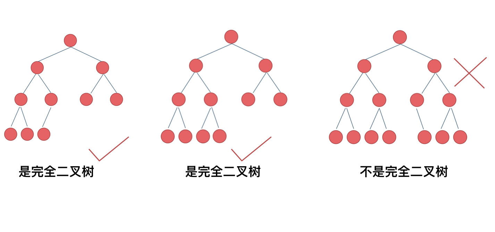
    3. 二叉搜索树

        >前面介绍的树，都没有数值的，而二叉搜索树是有数值的了，二叉搜索树是一个有序树。

        1. 若它的左子树不空，则左子树上**所有**结点的值均小于它的根结点的值；
        2. 若它的右子树不空，则右子树上**所有**结点的值均大于它的根结点的值；
        3. 它的左、右子树也分别为二叉搜索树

        深度优先中序遍历，得到数值结果会是一个递增数组。

        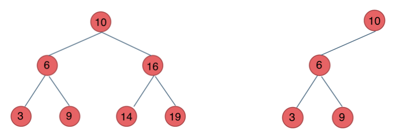
    4. 平衡二叉搜索树（AVL、Adelson-Velsky and Landis、平衡二叉树）

        它是一棵空树或它的左右两个子树的高度差的绝对值不超过1，并且左右两个子树都是一棵平衡二叉搜索树。

        

#### 树的遍历
树的遍历（树的搜索）：一种图的遍历，指的是按照某种规则，不重复地访问某种树的所有节点的过程。

1. 遍历

    1. 深度优先遍历（先往深走，遇到叶子节点再往回走）：

        >递归+栈，实现比较简单。

        1. 前（先）序遍历（pre-order traversal）：

            **根节点** -> 左子树 -> 右子树。
        2. 中序遍历（in-order traversal）：

            左子树 -> **根节点** -> 右子树。
        3. 后序遍历（post-order traversal）

            左子树 -> 右子树 -> **根节点**。
    2. 广度优先遍历（层级遍历）：

        >遍历+队列，实现比较简单。

        从上到下（从**根节点**到子树）、从左子树到右子树。
2. 搜索

    1. 深度优先搜索（depth-first search，DFS）：沿着树的深度遍历树的节点，尽可能深的搜索树的分支

        1. 首先将根节点放入**栈**中。
        2. 从栈中取出第一个节点，并检验它是否为目标。

            1. 若找到目标，则结束搜寻并回传结果；
            2. 否则将它某一个尚未检验过的直接子节点加入栈中。
        3. 重复步骤2。
        4. 若不存在未检测过的直接子节点。

            1. 将上一级节点加入栈中。
            2. 重复步骤2。
        5. 重复步骤4。
        6. 若栈为空，则表示整张图都检查过了——亦即图中没有欲搜寻的目标。结束搜寻并回传「找不到目标」。
    2. 广度优先搜索（breadth-first search，BFS，宽度优先搜索，横向优先搜索）：从根节点开始，沿着树的宽度遍历树的节点

        1. 首先将根节点放入**队列**中。
        2. 从队列中取出第一个节点，并检验它是否为目标。

            1. 若找到目标，则结束搜索并回传结果；
            2. 否则将它所有尚未检验过的直接子节点加入队列中。
        3. 重复步骤2。
        4. 若队列为空，表示整张图都检查过了——亦即图中没有欲搜索的目标。结束搜索并回传「找不到目标」。

><details>
><summary>e.g.</summary>
>
>针对二叉树：
>
>```
>      1
>    /   \
>   2     3
>  / \     \
> 4   5     6
>    / \
>   7   8
>```
>
>1. 深度优先，先序遍历：
>
>    1  2  4  5  7  8  3  6
>2. 深度优先，中序遍历：
>
>    4  2  7  5  8  1  3  6
>3. 深度优先，后序遍历：
>
>    4  7  8  5  2  6  3  1
>4. 广度优先遍历（层级遍历）：
>
>    1  2  3  4  5  6  7  8
></details>

### 堆（heap）
堆是一种满足特定条件的完全二叉树：

1. 总是一棵完全二叉树（complete binary tree，只有最底层的节点未被填满，且最底层节点尽量靠左填充）

    在数组起始位置为0的情形中：

    1. `父节点i`的左子节点在位置`2*i+1`
    2. `父节点i`的右子节点在位置`2*i+2`
    3. `子节点i`的父节点在位置`Math.floor((i-1)/2)`
2. 任意节点小于（或大于）它的所有后裔，最小元（或最大元）在堆的根上

    1. 小顶堆（min heap、最小堆、小根堆）：任意节点的值≤其子节点的值，根节点最小

        针对`{k1, k2, ...ki, ...kn}`n个项，当且仅当满足则为小顶堆：`ki <= k2i+1 且 ki <= k2i+2`（`i < n/2`）。
    2. 大顶堆（max heap、最大堆、大根堆）：任意节点的值≥其子节点的值，根节点最大

        针对`{k1, k2, ...ki, ...kn}`n个项，当且仅当满足则为：大顶堆`ki >= k2i+1 且 ki >= k2i+2`（`i < n/2`）。

#### 堆的创建
```js
// 创建大顶堆
function createMaxHeapify(arr) {
  arr = arr.slice(); // 浅复制

  /* 替换数组内位置 */
  function _swap(a, b) {
    var temp = arr[a];

    arr[a] = arr[b];
    arr[b] = temp;
  }

  /**
   * （前提：子节点已经是最大堆）使父节点为最大堆，使得父节点以下的子节点（所有后裔）永远小于各自的父节点
   * @param {Number} dadIndex 父节点索引
   * @param {Number} endIndex 调整到的最末尾索引
   */
  function _maxHeapify(dadIndex, endIndex) {
    var sonIndex = dadIndex * 2 + 1; // 父节点的左子节点位置

    if (sonIndex > endIndex) {
      /* 递归边界条件：子节点超出范围 */

      return;
    } else {
      if (sonIndex + 1 <= endIndex && arr[sonIndex] < arr[sonIndex + 1]) {
        /* 若有右子节点，选择两个子节点中较大的 */
        sonIndex += 1; // 父节点的右子节点位置
      }

      if (arr[dadIndex] <= arr[sonIndex]) {
        _swap(dadIndex, sonIndex); // 保证父节点大于子节点
        arguments.callee(sonIndex, endIndex); // 因为子节点变化，所以递归一遍原本是最大堆的子节点
      }
    }
  }

  var len = arr.length,
      i;

  // 将列表所有元素原封不动添加到堆中；倒序遍历堆（即层序遍历的倒序），依次对每个非叶节点执行“从顶至底堆化”
  for (i = Math.floor(len / 2) - 1; i >= 0; i--) {  /* i的初始值为堆的最后一个父节点（`Math.floor(len / 2) - 1 === Math.floor(len / 2 - 1)`） */
    _maxHeapify(i, len - 1);
  }

  return arr;
}
```

### 图（graph）
表示物件与物件之间的关系的方法，由一些小圆点（顶点、vertex）和连结这些圆点的线（边、edge）组成。

>其他数据结构：张量（Tensor），标量、向量、矩阵

---
## 算法（algorithms）
算法含义：[Hello 算法： 算法是什么](https://www.hello-algo.com/chapter_introduction/what_is_dsa/)

### 算法效率评估（算法复杂度：时间、空间）
1. 时间复杂度（Time Complexity）

    渐进时间复杂度，表示算法的执行时间与数据规模之间的增长关系，反应的只是一个趋势，不是统计算法运行时间。

    1. 设输入数据大小为n ，常见的时间复杂度类型包括（按照从低到高的顺序排列）：

        $O(1)$常数阶 < $O(log n)$对数阶 < $O(n)$线性阶 < $O(n * log n)$线性对数阶 < $O(n^2)$平方阶 < $O(n^3)$立方阶 < $O(2^n)$指数阶 < $O(n!)$阶乘阶
    2. <details>

        <summary>时间复杂度举例</summary>

        1. 二分搜索 或 每轮缩减一半的递归函数 的时间复杂度： $O(log n)$。

            原因：[为什么说二分查找的时间复杂度是O(log n)](https://github.com/JasonGaoH/KnowledgeSummary/blob/master/Docs/Algorithm/为什么说二分查找的时间复杂度是O(log%20n).md)。

            e.g. `function logRecur(n) { if (n <= 1) return 0; return logRecur(n / 2) + 1; }`
        2. 嵌套循环中，两层循环的时间复杂度分别为 $O(log n)$和 $O(n)$的函数： $O(n * log n)$

            主流排序算法，如：快速排序、归并排序、堆排序等。
        3. 一分为二的递归函数 的时间复杂度： $O(2^n)$。

            e.g. `function expRecur(n) { if (n == 1) return 1; return expRecur(n - 1) + expRecur(n - 1) + 1; }`
        4. 每次减少1的递归： $O(n!)$

            e.g. `function factorialRecur(n) { if (n == 0) return 1; let count = 0; for (let i = 0; i < n; i++) { count += factorialRecur(n - 1); } return count; }`
        </details>
2. 空间复杂度（Space Complexity）

    >程序运行时占用内存的大小，而不是~~可执行文件的大小~~。

    渐进空间复杂度，用来表示算法的存储空间与数据规模之间的增长关系，反应的只是一个趋势，不是统计算法运行空间。

### 分治（divide and conquer）
1. 通常基于递归实现，包括“分”和“治”两个步骤：

    1. 分（划分阶段）：递归地将原问题分解为两个或多个子问题，直至到达最小子问题时终止；
    2. 治（合并阶段）：从已知解的最小子问题开始，从底至顶地将子问题的解进行合并，从而构建出原问题的解。
2. 判断是否适合分治解决：

    1. 问题可以被**分解**：原问题可以被分解成规模更小、类似的子问题，以及能够以相同方式递归地进行划分；
    2. 子问题是**独立**的：子问题之间是没有交集的，互相没有依赖，可以被独立解决；
    3. 子问题的解可以被**合并**：原问题的解通过合并子问题的解得来。

- 提升效率原因：

    1. 算法操作次数减少
    2. 子问题能并行操作

### 回溯（backtracking）
一种通过穷举来解决问题的方法，它的核心思想是从一个初始状态出发，暴力搜索所有可能的解决方案，当遇到正确的解则将其记录，直到找到解或者尝试了所有可能的选择都无法找到解为止。

1. 搜索过程：

    通过深度优先搜索来尝试各种选择，当遇到不满足约束条件的情况时，则撤销上一步的选择，退回到之前的状态，并继续尝试其他选择。尝试与回退是两个方向相反的操作。

    1. 尝试
    2. 回退

### 动态规划（dynamic programming）
一个重要的算法范式，它将一个问题分解为一系列更小的子问题，并通过**存储子问题的解来避免重复计算**，从而大幅提升时间效率。

>不考虑时间的前提下，所有动态规划问题都可以用回溯（暴力搜索）进行求解，但递归树中存在大量的重叠子问题，效率极低。通过引入记忆化列表，可以存储所有计算过的子问题的解，从而保证重叠子问题只被计算一次。

1. 特性（需要满足）：

    1. 重叠子问题
    2. 最优子结构

        原问题的最优解是从子问题的最优解构建得来的。
    3. 无后效性

        给定一个确定的状态，它的未来发展只与当前状态有关，而与当前状态过去所经历过的所有状态无关。
2. 求解步骤：

    1. 思考每轮的决策，定义状态，从而得到dp表；
    2. 找出最优子结构，进而推导出状态转移方程；
    3. 确定边界条件和状态转移顺序。

### 贪心（greedy）
一种常见的解决优化问题的算法，其基本思想是在问题的每个决策阶段，都选择当前看起来最优的选择，即贪心地做出局部最优的决策，以期望获得全局最优解。

1. 特性（保证找到最优解需要满足）：

    1. 贪心选择性质

        >对于许多问题，证明贪心选择性质不是一件易事。

        只有当局部最优选择始终可以导致全局最优解时，贪心算法才能保证得到最优解。
    2. 最优子结构

        原问题的最优解包含子问题的最优解。
2. 求解步骤：

    1. 问题分析

        梳理与理解问题特性，包括状态定义、优化目标和约束条件等。
    2. 贪心策略确定

        确定如何在每一步中做出贪心选择。这个策略能够在每一步减小问题的规模，并最终能解决整个问题。
    3. 正确性证明

        >如若没有头绪，我们通常会选择面向测试用例进行 Debug ，一步步修改与验证贪心策略。

        通常需要证明问题具有贪心选择性质和最优子结构。这个步骤可能需要使用到数学证明，例如归纳法或反证法等。


>子问题侧重点：
>
>| 算法类型 | 子问题侧重点 |
>| --- | --- |
>| 分治算法 | 递归地将原问题划分为多个相互独立的子问题，直至最小子问题，并在回溯中合并子问题的解，最终得到原问题的解。 |
>| 回溯算法 | 在尝试和回退中穷举所有可能的解，并通过剪枝避免不必要的搜索分支。<br>原问题的解由一系列决策步骤构成，我们可以将每个决策步骤之前的子序列看作为一个子问题。 |
>| 动态规划 | 也对问题进行递归分解，但与分治算法的主要区别是，它的子问题是相互依赖的，在分解过程中会出现许多重叠子问题。 |
>| 贪心算法 | 不会重新考虑过去的决策，而是一路向前地进行贪心选择。<br>需要去验证子问题的解就是原问题的解。 |

---
## 排序算法
>部分排序算法演示：[visualgo](https://visualgo.net/sorting)。

### 评价维度
1. [算法效率评估（算法复杂度：时间、空间）](https://github.com/realgeoffrey/knowledge/blob/master/网站前端/数据结构与算法/README.md#算法效率评估算法复杂度时间空间)
2. 稳定排序/非稳定排序：

    「稳定排序」在完成排序后，相等元素在数组中的相对顺序不发生改变。

    >若一个排序算法是稳定的，则当有两个相等键值的纪录R和S，且在原本的列表中R出现在S之前，在排序过的列表中R也将会是在S之前。
3. 比较排序/非比较排序：

    1. 「基于比较的排序」依赖于比较运算符（`<`、`=`、`>`）来判断元素的相对顺序，从而排序整个数组，理论最好时间复杂度为 $O(n*log n)$。
    2. 「非比较排序」不使用~~比较运算符~~，时间复杂度可达 $O(n)$，但其*通用性*相对较差。
4. 自适应排序/非自适应排序：

    「自适应排序」的时间复杂度会受输入数据的影响，即最好、最坏、平均时间复杂度并不完全相等。

    - 自适应性需要根据具体情况来评估

        1. 若最坏时间复杂度差于平均时间复杂度，则说明排序算法在某些数据下性能可能劣化，因此被视为负面属性。
        2. 若最好时间复杂度优于平均时间复杂度，则被视为正面属性。

理想排序算法期望：**运行快**（时间复杂度低）、**原地**（空间复杂度低）、**稳定**、**通用性好**、**正向自适应**。显然，迄今为止尚未发现兼具以上所有特性的排序算法。因此，在选择排序算法时，需要根据具体的数据特点和问题需求来决定。

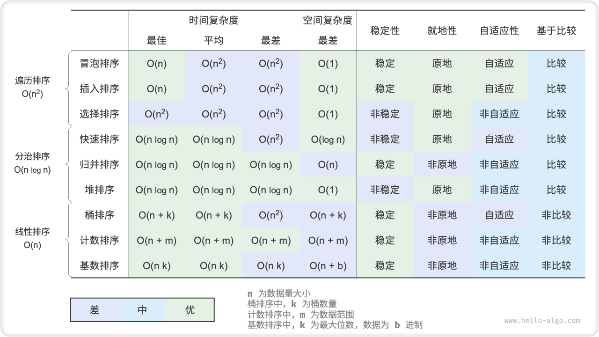

---
### 比较排序
>比较排序理论最好时间复杂度为 $O(n*log n)$。

#### 插入排序（insertion sort）
```js
function insertionSort(arr) {
    arr = arr.slice();  // 浅复制

    var i, len, temp, j;

    for (i = 1, len = arr.length; i < len; i++) { /* 逐个取出与前面元素对比（前面元素已经排序） */
        temp = arr[i];   // 对比元素

        for (j = i - 1; j >= 0 && arr[j] > temp; j--) {   /* 向前逐个对比 */
            arr[j + 1] = arr[j];    // 若前面元素大于对比元素，则前面元素向后移一位
        }

        arr[j + 1] = temp;   // 对比元素插入空位
    }

    return arr;
}
```
>1. 思路：
>
>    - 顺序遍历元素（第一个元素默认已排序）：
>
>        - 取出对比元素，逐个遍历与前面排序元素对比：
>
>            若排序元素大于对比元素，将排序元素向后移一位；否则将对比元素插入到排序元素后一位。
>2. 稳定、比较排序
>3. 时间复杂度： $O(n^2)$（自适应排序）
>
>    最坏情况下，逆序数组需要`(n - 1) * n / 2`次排序，因此是 $O(n^2)$；最好情况下，有序数组 $O(n)$。
>4. 空间复杂度： $O(1)$（原地排序）


#### 冒泡排序（bubble sort）
```js
function bubbleSort(arr) {
    arr = arr.slice();  // 浅复制

    var len = arr.length,
        i, j, temp, flag;

    for (i = 0; i < len - 1; i++) { /* 一共比较趟数 */
        flag = false; // 标志位：若某轮“冒泡”中没有执行任何交换操作，则说明数组已经完成排序，可直接返回结果

        for (j = 0; j < len - i - 1; j++) { /* 每一趟比较的次数（已置底的不需要比较） */
            if (arr[j] > arr[j + 1]) {    /* 相邻的元素大的放后面 */
                temp = arr[j];
                arr[j] = arr[j + 1];
                arr[j + 1] = temp;

                flag = true;
            }
        }

        if (!flag) { break; }
    }

    return arr;
}
```
>1. 思路：
>
>    1. 比较相邻的元素：若第一个比第二个大，则交换它们两个；
>    2. 对每一对相邻元素作同样的比较，从开始第一对到结尾的最后一对。这步做完后，最后的元素会是最大的数；
>    3. 针对所有的元素重复以上的步骤，除了已经置底的（遍历几次就有几个元素置底）；
>    4. 持续每次对越来越少的元素重复上面的步骤，直到没有任何一对数字需要比较。
>2. 稳定、比较排序
>3. 时间复杂度： $O(n^2)$（自适应排序）
>
>    引入flag优化后，最好时间复杂度： $O(n)$。
>4. 空间复杂度： $O(1)$（原地排序）

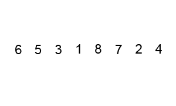

#### 快速排序（quick sort）
```js
function quickSort(arr) {
    arr = arr.slice();  // 浅复制

    var len = arr.length,
        i, middle, leftArr, rightArr;

    if (len <= 1) { /* 递归边界条件 */

        return arr;
    } else {
        for (i = 1, middle = arr[0], leftArr = [], rightArr = []; i < len; i++) {   /* 以0索引元素为「基准」 */
            if (arr[i] < middle) {   /* 小于基准的元素放左数组 */
                leftArr.push(arr[i]);
            } else {       /* 大于等于基准的元素放右数组 */
                rightArr.push(arr[i]);
            }
        }

        return arguments.callee(leftArr).concat([middle], arguments.callee(rightArr));   // 顺序合并左、中、右数组
    }
}
```
>1. 思路：
>
>    1. 从数列中挑出一个「基准」（pivot）元素；
>
>        >此处可以优化，选择越靠近中位数的元素，时间复杂度越接近平均时间复杂度。
>    2. 遍历其他元素，比基准值小的摆放在基准前面，比基准值大的摆在基准的后面（相同可以到放置任一边）；
>    3. 递归地把前后两数组进行相同操作（分治策略：将一个较长数组的排序问题简化为两个较短数组的排序问题）。
>2. 非稳定、比较排序
>3. 时间复杂度： $O(n*log n)$（自适应排序）
>
>    平均 $O(n*log n)$；在最坏情况下，每轮划分操作都将长度为n的数组划分为长度为0和n-1的两个子数组，此时递归层数达到n层，每层中的循环数为n，总体使用 $O(n^2)$时间。
>4. 空间复杂度： $O(n)$（非原地排序）
>
>    可以优化分割数组算法，不需要额外数组存储，变成空间复杂度 $O(n)$（原地排序）。

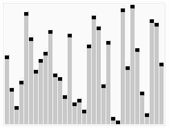

#### 希尔排序
```js
function shellSort(arr) {
    arr = arr.slice();  // 浅复制

    var len = arr.length,
        gap, i, j, temp;

    for (gap = Math.floor(len / 2); gap > 0; gap = Math.floor(gap / 2)) {   /* 不断分割成越来越大的区域进行插入排序 */
        for (i = gap; i < len; i++) {   /* 间隔为gap索引元素的插入排序 */
            temp = arr[i];

            for (j = i - gap; j >= 0 && arr[j] > temp; j -= gap) {
                arr[j + gap] = arr[j];
            }

            arr[j + gap] = temp;
        }
    }

    return arr;
}
```
>1. 思路：
>
>    将元素分为几个区域来提升*插入排序*的性能：让一个元素可以一次性朝最终位置前进一大步。算法再取越来越小的步长进行排序，最后是步长为1的插入排序。
>2. 非稳定、比较排序
>3. 时间复杂度：根据步长取值而变化，最好 $O(n*log^2 n)$，最坏 $O(n^2)$
>4. 空间复杂度： $O(1)$

#### 梳排序
```js
function combSort(arr) {
    arr = arr.slice();  // 浅复制

    var SHRINK_FACTOR = 0.8,    // 递减率
        len = arr.length,
        gap, swapped, i, temp;

    for (gap = len, swapped = true; gap > 1 || swapped; ) {
        if (gap > 1) {
            gap = Math.floor(gap * SHRINK_FACTOR);  // 间距递减
        }

        swapped = false;

        for (i = 0; i < len - gap; i++) {
            if (arr[i] > arr[i + gap]) {
                temp = arr[i];
                arr[i] = arr[i + gap];
                arr[i + gap] = temp;

                swapped = true; // 进行过交换，因此还未排序好
            }
        }
    }

    return arr;
}
```
>1. 思路：
>
>    1. 改良自*冒泡排序*（仅比较相邻两项），比较的两项间距可以大于1；
>    2. 开始时的间距设定为数列长度，并在循环中以固定比率递减（0.8）；
>    3. 当间距递减为1时，进行冒泡排序。
>2. 非稳定、比较排序
>3. 时间复杂度： $O(n^2)$
>4. 空间复杂度： $O(1)$

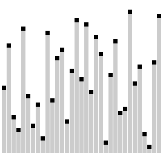

#### 归并排序（merge sort）
```js
function mergeSort(arr) {
  arr = arr.slice(); // 浅复制

  var len = arr.length,
      midIndex, left, right;

  if (len <= 1) {
    /* 递归边界条件 */

    return arr;
  } else {
    midIndex = Math.floor(len / 2);
    left = arr.slice(0, midIndex);
    right = arr.slice(midIndex);

    return _merge(arguments.callee(left), arguments.callee(right));
  }
}

/* 合并2个已经分别排序好的数组 */
function _merge(arrA, arrB) {
  var newArr = [];

  /* 对比2个数组第一个元素，小的元素加入新数组并从原数组删去，直到至少一个数组为空 */
  while (arrA.length && arrB.length) {
    if (arrA[0] < arrB[0]) {
      newArr.push(arrA.shift());
    } else {
      newArr.push(arrB.shift());
    }
  }

  return newArr.concat(arrA.concat(arrB)); // 顺序合并newArr、arrA、arrB数组
}
```
>1. 思路：
>
>    1. 将相邻两个元素进行**归并操作**（将两个已经排序的数列合并成排序数列），每个排序后数列包含两个元素；
>    2. 重复以上操作，直到所有元素归并操作成一个数列。
>2. 稳定、比较排序
>3. 时间复杂度： $O(n*log n)$（非自适应排序）
>4. 空间复杂度： $O(n)$（非原地排序）

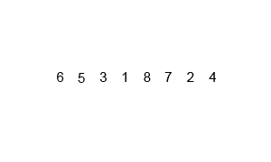

#### 选择排序（selection sort）
```js
function selectionSort(arr) {
    arr = arr.slice();  // 浅复制

    var len = arr.length,
        i, j, minIndex, temp;

    for (i = 0; i < len - 1; i++) {
        minIndex = i;

        for (j = i + 1; j < len; j++) {  /* 找出最小的元素 */
            if (arr[minIndex] > arr[j]) {
                minIndex = j;
            }
        }

        temp = arr[minIndex];
        arr[minIndex] = arr[i];
        arr[i] = temp;
    }

    return arr;
}
```
>1. 思路：
>
>    从剩余未排序元素中寻找最小（大）元素，放到已排序数列的末尾。直到所有元素均排序完毕。
>2. 非稳定、比较排序
>3. 时间复杂度： $O(n^2)$（非自适应排序）
>4. 空间复杂度： $O(1)$（原地排序）


#### 堆排序（heap sort）
```js
function heapSort(arr) {
  arr = arr.slice(); // 浅复制

  /* 替换数组内位置 */
  function _swap(a, b) {
    var temp = arr[a];

    arr[a] = arr[b];
    arr[b] = temp;
  }

  /**
   * （前提：子节点已经是最大堆）使父节点为最大堆，使得父节点以下的子节点（所有后裔）永远小于各自的父节点
   * @param {Number} dadIndex 父节点索引
   * @param {Number} endIndex 调整到的最末尾索引
   */
  function _maxHeapify(dadIndex, endIndex) {
    var sonIndex = dadIndex * 2 + 1; // 父节点的左子节点位置

    if (sonIndex > endIndex) {
      /* 递归边界条件：子节点超出范围 */

      return;
    } else {
      if (sonIndex + 1 <= endIndex && arr[sonIndex] < arr[sonIndex + 1]) {
        /* 若有右子节点，选择两个子节点中较大的 */
        sonIndex += 1; // 父节点的右子节点位置
      }

      if (arr[dadIndex] <= arr[sonIndex]) {
        _swap(dadIndex, sonIndex); // 保证父节点大于子节点
        arguments.callee(sonIndex, endIndex); // 因为子节点变化，所以递归一遍原本是最大堆的子节点
      }
    }
  }

  var len = arr.length,
      i;

  // 将列表所有元素原封不动添加到堆中；倒序遍历堆（即层序遍历的倒序），依次对每个非叶节点执行“从顶至底堆化”
  for (i = Math.floor(len / 2) - 1; i >= 0; i--) {  /* i的初始值为堆的最后一个父节点（`Math.floor(len / 2) - 1 === Math.floor(len / 2 - 1)`） */
    _maxHeapify(i, len - 1);
  }

  for (i = len - 1; i > 0; i--) {
    /* 把已达成的最大堆的首元素放到末尾，并重新进行减少长度的最大堆排序 */
    /* 原本已经是最大堆，替换首元素之后需要执行一次最大堆函数，就再次成为为最大堆 */
    _swap(0, i);
    _maxHeapify(0, i - 1);
  }

  return arr;
}
```
>1. 思路：
>
>    循环进行：创建[最大堆](https://github.com/realgeoffrey/knowledge/blob/master/网站前端/数据结构与算法/README.md#堆heap)，移除在顶端的最大元素。
>2. 非稳定、比较排序
>3. 时间复杂度： $O(n*log n)$（非自适应排序）
>4. 空间复杂度： $O(1)$（原地排序）

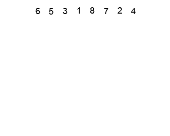

---
### 非比较排序
>非比较排序理论最好时间复杂度为 $O(n)$。

#### 桶排序（bucket sort）
>桶排序适用于处理体量很大的数据。e.g. 输入数据包含100万个元素，由于空间限制，系统内存无法一次性加载所有数据。此时，可以将数据分成1000个桶，然后分别对每个桶进行排序，最后将结果合并。桶排序的关键在于对数据进行平均分配。

```js
function bucketSort(arr) {
  arr = arr.slice(); // 浅复制

  // 初始化k=n/2个桶，预期向每个桶分配2个元素（可调整）
  const k = arr.length / 2;
  const buckets = [];
  for (let i = 0; i < k; i++) {
    buckets.push([]);
  }

  // 1. 将数组元素分配到各个桶中（分配桶的映射关系需要额外逻辑支持，这里用下面的假设）
  for (const num of arr) {
    // 假设：输入数据范围 [0, 1)，使用 num * k 映射到索引范围 [0, k-1]
    const i = Math.floor(num * k);
    // 将 num 添加进桶 i
    buckets[i].push(num);
  }
  // 2. 对各个桶执行排序
  for (const bucket of buckets) {
    // 使用内置排序函数，也可以替换成其他排序算法
    bucket.sort((a, b) => a - b);
  }
  // 3. 遍历桶合并结果
  let i = 0;
  for (const bucket of buckets) {
    for (const num of bucket) {
      arr[i++] = num;
    }
  }

  return arr;
}
```
>1. 思路：
>
>    1. 初始化k个桶，将n个元素分配到这些桶中；
>    2. 对每个桶内分别执行排序（不限定桶内排序方式）；
>    3. 按照桶的从小到大的顺序，合并结果。
>2. 稳定/非稳定（取决于排序桶内元素的算法是否稳定）、非比较排序
>3. 时间复杂度：平均 $O(n+k)$（k：桶数）（自适应排序）
>
>    在最坏情况下，所有数据被分配到一个桶中，且排序该桶使用 $O(n^2)$。
>4. 空间复杂度： $O(n+k)$（k：桶数）（非原地排序）

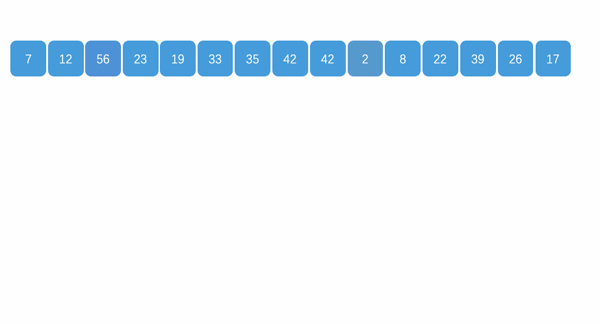

#### 计数排序（counting sort）
>从桶排序的角度看，可以将计数排序中的计数数组counter的每个索引视为一个桶，将统计数量的过程看作是将各个元素分配到对应的桶中。本质上，计数排序是桶排序在整型数据下的一个特例。
>- 局限性：
>
>    1. 计数排序只适用于非负整数。若想要将其用于其他类型的数据，需要确保这些数据可以被转换为非负整数，并且在转换过程中不能改变各个元素之间的相对大小关系。e.g. 对于包含负数的整数数组，可以先给所有数字加上一个常数，将全部数字转化为正数，排序完成后再转换回去即可。
>    2. 计数排序适用于数据量大但数据范围较小的情况。

```js
function countingSort(arr) {
    var len = arr.length,
        min = Math.min.apply(null, arr),
        max = Math.max.apply(null, arr),
        countArr = [],
        newArr = [],
        i, j, k;

    for (i = 0; i < len; i++) { /* 元素值x出现次数 -> countArr[x] */
        countArr[arr[i]] = countArr[arr[i]] ? countArr[arr[i]] + 1 : 1;
    }

    // 计算“前缀和”：countArr[arr[k]] - 1代表元素arr[k]在结果数组newArr中最后一次出现的索引
    for (j = min; j < max; j++) {   /* 元素值x出现次数+值小于x元素出现计数累积 -> countArr[x] */
        countArr[j + 1] = (countArr[j + 1] || 0) + (countArr[j] || 0);
    }

    for (k = len - 1; k >= 0; countArr[arr[k]]--, k--) {    /* 反向填充 */
        newArr[countArr[arr[k]] - 1] = arr[k];  // newArr[位置]=arr数据
    }

    return newArr;
}
```
>1. 思路：
>
>    1. 找出数列中最大、最小元素；
>    2. 统计值为i的元素出现的次数，存入count的第i项。对count每项计数累加，每一项和前一项相加；
>    3. 反向填充目标数组：将每个元素值i放在count(i)-1项，每放一个元素就将count(i)减去1。
>2. 稳定、非比较排序
>3. 时间复杂度： $O(n+k)$（k：元素最大值）
>
>    一般情况下n远大于k，时间复杂度趋于 $O(n)$。
>4. 空间复杂度： $O(n+k)$（k：元素最大值）（非原地排序）

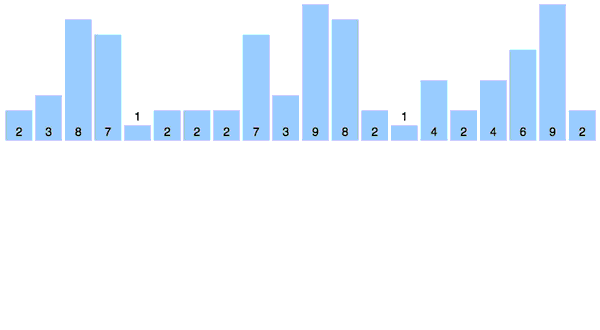

#### 基数排序（radix sort）
>相较于计数排序，基数排序适用于数值范围较大的情况，但前提是数据必须可以表示为固定位数的格式，且位数不能过大。e.g. 浮点数不适合使用基数排序，因为其位数k过大，可能导致时间复杂度 $O(n*k)$ 远大于 $O(n^2)$。

```js
function radixSort(arr) {
    arr = arr.slice();  // 浅复制

    var len = arr.length,
        i, bucket, max, maxLen, str, j, num, k, kLen;

    for (i = 0, bucket = []; i < 10; i++) { /* 创建十个空桶（10进制），每一位数循环先放入再倒出清空 */
        bucket[i] = [];
    }

    for (i = 1, max = arr[0]; i < len; i++) {   /* 获取元素最大值 */
        if (arr[i] > max) {
            max = arr[i];
        }
    }

    maxLen = max.toString(10).length;   // 获取最大值元素的位数

    for (i = 0; i < maxLen; i++) { /* LSD：从最低位（个位）到最高位，对每一个位数进行一次排序 */
        for (j = 0; j < len; j++) { /* 元素放入对应桶里 */
            str = arr[j].toString(10);

            if (str.length > i) {  /* 根据数字第i位上的数字放置对应的桶。e.g. i=0：个位数字放置相应桶；i=1：十位数字放置相应桶 */
                num = parseInt(str[str.length - 1 - i], 10);    // 获取i位置上的数字（i=0：个位；i=1：十位；i=2：百位...）
                bucket[num].push(arr[j]);
            } else {    /* 元素小于位数都放入第一个桶内（已经排序好的元素）；第一个桶还有放第i位是0的数，会在之后更高位被排序 */
                bucket[0].push(arr[j]);
            }
        }

        arr = [];   // 清空数组以便从桶中接收排序好的数组

        for (j = 0; j < 10; j++) {  /* 把每个桶内数组放回原始数组中（桶内不排序） */
            for (k = 0, kLen = bucket[j].length; k < kLen; k++) {
                arr.push(bucket[j][k]);
            }

            bucket[j] = [];
        }
    }

    return arr;
}
```
>1. 思路：
>
>    LSD：从最低位（个位）开始，依次进行一次排序，排序结束后再用已经排序过的内容进行高一位的排序。直到最高位排序结束。
>2. 稳定、非比较排序
>3. 时间复杂度： $O(n*k)$（k：元素最大位数）
>4. 空间复杂度： $O(n + d)$(d：进制)（非原地排序）

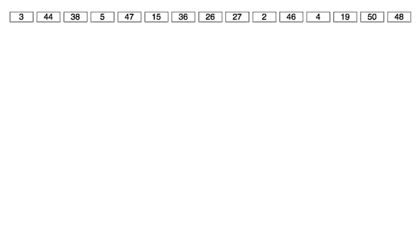

---
## 搜索算法（查找算法）

### 二分搜索（binary search，二分查找）
>对于已经排序的数组，一般考虑使用二分搜索的方式解题。

一种基于分治策略的高效搜索算法，利用数据的有序性，每轮减少一半搜索范围，直至找到目标元素或搜索区间为空（左右边界越界）为止。

1. 循环：

    ```js
    function binarySearch(arr, searchVal) {
        var leftIndex = 0,
            rightIndex = arr.length - 1,
            middleIndex;
        // tips: `var targetIndex = -1;`

        while (leftIndex <= rightIndex) {
            middleIndex = Math.floor((leftIndex + rightIndex) / 2);

            if (searchVal < arr[middleIndex]) { /* 目标小于中间数，在小的一堆找 */
                rightIndex = middleIndex - 1;
            } else if (searchVal > arr[middleIndex]) {  /* 目标大于中间数，在大的一堆找 */
                leftIndex = middleIndex + 1;
            } else {    /* 找到 */
                // tips: 若这里的数组包含重复数字并且查找第一个目标，则用`rightIndex = middleIndex - 1; targetIndex = middleIndex;`替换下一行
                return middleIndex;
            }
        }

        /* 不存在 */
        return -1;
        // tips: 若这里的数组包含重复数字并且查找第一个目标，则用`return targetIndex;`替换上一行
    }
    ```

    >空间复杂度：O(1)。

>实现注意：区间的定义，边界判定（大小判断时有没有等号`=`，边界需不需要加减一`+-1`）。

2. 递归：

    ```js
    function binarySearch(arr, searchVal, leftIndex, rightIndex) {
        if (typeof leftIndex === 'undefined' || typeof rightIndex === 'undefined') {
            leftIndex = 0;
            rightIndex = arr.length - 1;
        }

        var middle = Math.floor((rightIndex + leftIndex) / 2);

        if (leftIndex > rightIndex) {   /* 递归边界条件：不存在 */

            return -1;
        } else {
            if (searchVal < arr[middle]) { /* 目标小于中间数，在小的一堆找 */

                return arguments.callee(arr, searchVal, leftIndex, middle - 1);
            } else if (searchVal > arr[middle]) {  /* 目标大于中间数，在大的一堆找 */

                return arguments.callee(arr, searchVal, middle + 1, rightIndex);
            } else {    /* 递归边界条件：找到 */

                return middle;
            }
        }
    }
    ```

    >空间复杂度：O(log n)。

>1. 思路：
>
>    1. 在有序数组中查找某一特定元素的搜索算法，每一次比较都使搜索范围缩小一半；
>    2. 搜索过程从数组的中间元素开始：
>
>        1. 若中间元素正好是要查找的元素，则搜索过程结束；
>        2. 若某一特定元素大于或小于中间元素，则在数组大于或小于中间元素的那一半中查找，并且也从中间元素开始比较；
>        3. 若在某一步骤数组为空，则代表找不到。
>2. 时间复杂度： $O(log n)$

- <details>

    <summary>简单变形的二分搜索：</summary>

    ```js
    /**
     * 针对Number型递增数组，从前往后 二分搜索，
     *   若数组存在target则返回`true`；若不存在则返回 `第一个大于target的数所在的数组下标`；若不存在大于target的数则返回 `false`
     * @param {number[]} arr  递增数组
     * @param {number} target 目标
     * @param {number} [start = 0] 数组开始下标
     * @param {number} [end = arr.length - 1] 数组结束下标
     * @return {boolean | number}
     */
    var hasTarget1 = function ({
      arr = [],
      target,
      start = 0,
      end = arr.length - 1,
    } = {}) {
      let left = start;
      let right = end;

      let foundBigger = false;

      while (left <= right) {
        const middle = Math.floor((left + right) / 2);
        if (arr[middle] > target) {
          right = middle - 1;
          foundBigger = middle;
        } else if (arr[middle] < target) {
          left = middle + 1;
        } else {
          return true;
        }
      }

      return foundBigger;
    };


    /**
     * 针对Number型递增数组，从后往前 二分搜索，
     *   若数组存在target则返回`true`；若不存在则返回 `第一个小于target的数所在的数组下标`；若不存在小于target的数则返回 `false`
     * @param {number[]} arr  递增数组
     * @param {number} target 目标
     * @param {number} [start = arr.length - 1] 数组开始下标
     * @param {number} [end = 0] 数组结束下标
     * @return {boolean | number}
     */
    var hasTarget2 = function ({
      arr = [],
      target,
      start = arr.length - 1,
      end = 0,
    } = {}) {
      let right = start;
      let left = end;

      let foundSmaller = false;

      while (right >= left) {
        const middle = Math.floor((right + left) / 2);
        if (arr[middle] > target) {
          right = middle - 1;
        } else if (arr[middle] < target) {
          left = middle + 1;
          foundSmaller = middle;
        } else {
          return true;
        }
      }

      return foundSmaller;
    };
    ```
    </details>

### 暴力搜索
暴力搜索通过遍历数据结构的每个元素来定位目标元素。优点是简单且通用性好，无须对数据做预处理和借助额外的数据结构。然而，此类算法的时间复杂度为 $O(n)$，因此在数据量较大的情况下性能较差。

1. “线性搜索”适用于数组和链表等线性数据结构。它从数据结构的一端开始，逐个访问元素，直到找到目标元素或到达另一端仍没有找到目标元素为止。
2. “广度优先搜索”和“深度优先搜索”是图和树的两种遍历策略。广度优先搜索从初始节点开始逐层搜索，由近及远地访问各个节点。深度优先搜索是从初始节点开始，沿着一条路径走到头为止，再回溯并尝试其他路径，直到遍历完整个数据结构。

### 哈希搜索
1. 适合对查询性能要求很高的场景，平均时间复杂度为 $O(1)$。
2. 不适合需要有序数据或范围查找的场景，因为哈希表无法维护数据的有序性。
3. 对哈希函数和哈希冲突处理策略的依赖性较高，具有较大的性能劣化风险。
4. 不适合数据量过大的情况，因为哈希表需要额外空间来最大程度地减少冲突，从而提供良好的查询性能。

### 树查找
1. 适用于海量数据，因为树节点在内存中是离散存储的。
2. 适合需要维护有序数据或范围查找的场景。
3. 在持续增删节点的过程中，二叉搜索树可能产生倾斜，时间复杂度劣化至 $O(n)$。
4. 若使用 AVL 树或红黑树，则各项操作可在 $O(log n)$效率下稳定运行，但维护树平衡的操作会增加额外开销。
